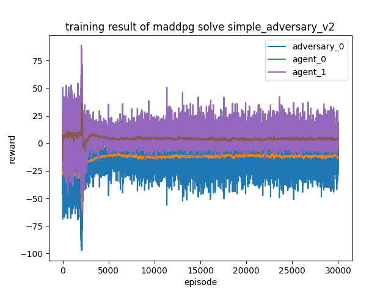
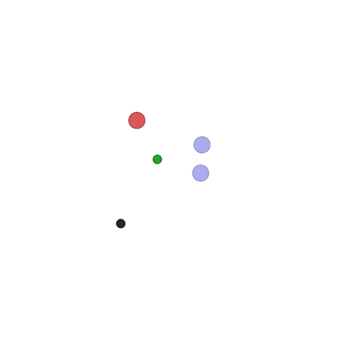
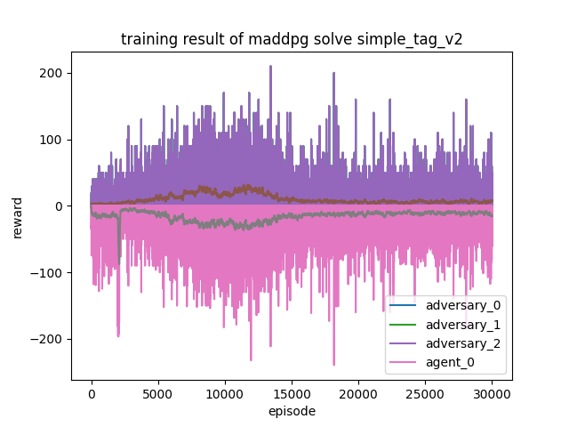

# MADDPG using PyTorch
implementation of [MADDPG](https://arxiv.org/pdf/1706.02275.pdf) using PyTorch
and [multiagent-particle-envs](https://github.com/openai/multiagent-particle-envs)

# Usage

training and evaluation is simple and straightforward, take `simple_spread` for example:

```shell
python main.py simple_adversary  # training
python evaluate.py simple_adversary  # evaluation
```

more details about arguments can be found in `main.py`, `evaluate.py`
or simply run `python main.py --help`, `python evaluate.py --help`

# Result

|  environment name   | training result  |  evaluation result  |
|  ----  | ----  | ---  |
| simple_adversary  |  |  | 
| simple_tag  |  |  | 


# reference

- implementation of [openai](https://github.com/openai/maddpg)
- implementation of [Git-123-Hub](https://github.com/Git-123-Hub/maddpg-mpe-pytorch/blob/master/readme.md)
